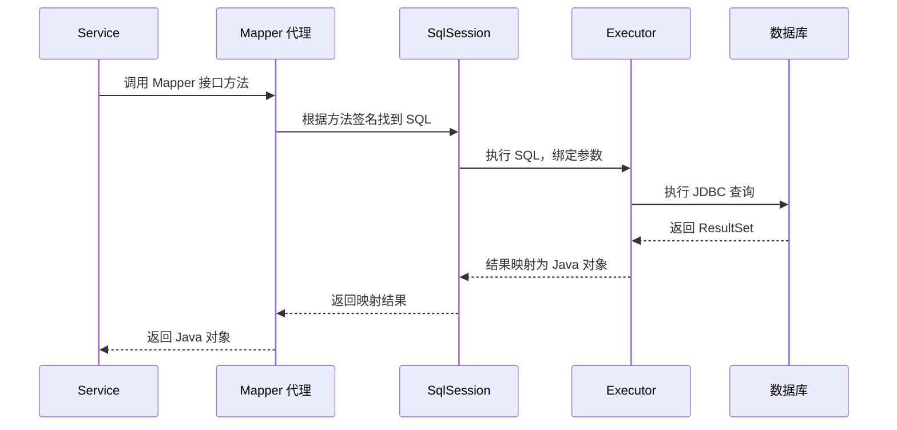

<!-- markdownlint-disable MD025 -->

# Java Spring MyBatis

## 为什么要学 MyBatis

前面几节我们用了大量篇幅学 JPA 和 Spring Data JPA — Entity 定义、Repository 接口、命名约定、事务管理，整个 ORM 体系已经完整了。你可能会问：既然 JPA 这么好用，为什么还要学 MyBatis？

JPA 的实力边界在"复杂查询"上。

假设你需要写一个报表功能的 SQL：8 张表联查、10 个动态筛选条件、GROUP BY 加 HAVING、窗口函数做排名、然后用数据库特有的 JSON 函数格式化输出。这种场景下，JPA 的命名约定完全用不了，`@Query` 写 JPQL 也很难表达（JPQL 没有窗口函数，不支持数据库特有语法），Specification 的动态条件构建会让代码变得难以阅读。

这就是 MyBatis 的主场 — 你把完整 SQL 写在一个 XML 文件或注解里，MyBatis 只负责参数绑定和结果映射。你拥有 SQL 的全部控制权，同时又避免了 JDBC 的样板代码。

## 核心概念

### MyBatis 是什么

MyBatis 是一种"半自动"的持久层框架。和 JPA 的"全自动 ORM"不同，MyBatis 不帮你生成 SQL — **你自己写 SQL，它帮你做参数映射和结果映射**。

换一种说法：JPA 就像自动驾驶汽车，你告诉它目的地，它规划路线、换挡、转向全包了。MyBatis 更像手动挡汽车 — 你决定走哪条路（写什么 SQL），它帮你处理油门和离合器（参数和结果映射），但方向盘始终在你手里。

MyBatis 的三种核心工作方式：

1. **注解 SQL** — 在 Mapper 接口方法上直接写 SQL（适合简单查询）
2. **XML Mapper** — 在 XML 文件中写 SQL（适合复杂查询，SQL 和 Java 代码分离）
3. **混合模式** — 简单查询用注解，复杂查询用 XML

### 为什么需要 MyBatis

JPA 在两个场景下会让人很痛苦：

**场景一：复杂报表查询**

一个后台管理的用户列表页，筛选条件包括：用户名（模糊）、邮箱（模糊）、状态（多选）、注册时间范围、订单数量范围、按不同字段排序。用 JPA 的 Specification 写这个：

```java
Specification<User> spec = (root, query, cb) -> {
    List<Predicate> predicates = new ArrayList<>();
    if (name != null) predicates.add(cb.like(root.get("name"), "%" + name + "%"));
    if (email != null) predicates.add(cb.like(root.get("email"), "%" + email + "%"));
    if (status != null) predicates.add(cb.equal(root.get("status"), status));
    // ... 更多条件
    return cb.and(predicates.toArray(new Predicate[0]));
};
```

这段代码的逻辑等价于一行 SQL 的 WHERE 子句，却写了十几行 Java 代码。而且你看不到最终的 SQL 长什么样 — 排查慢查询时，你对着 Java 代码猜 SQL，效率很低。

**场景二：需要数据库特有功能**

JPQL 是面向对象的查询语言，它没有以下能力：窗口函数（`ROW_NUMBER()`、`RANK()`）、递归 CTE（`WITH RECURSIVE`）、数据库特有函数（`GROUP_CONCAT`、`JSON_ARRAYAGG`）、Hint 提示（`FOR UPDATE SKIP LOCKED`）。当业务需要这些能力时，JPA 只能用原生 SQL 查询 — 但原生 SQL 和 JPA 的 Entity 管理混在一起，反而容易出错。

MyBatis 恰好适合这两个场景。你直接写 SQL，用动态 SQL 标签处理条件组合，SQL 和 Java 代码物理分离，排错时直接看 SQL 文件。

### 没有 MyBatis 会怎样

如果只有 JPA 而没有 MyBatis 这类框架：

- 复杂查询时，你会被迫在 JPA 的抽象层上绕来绕去（Specification 套 Specification，或大量用 `nativeQuery = true`），代码越来越难看
- 排查慢查询时，你需要从 Hibernate 日志中提取生成的 SQL，而 Hibernate 生成的 SQL 往往很冗长、别名难以阅读
- 当 DBA 给你一个优化过的 SQL，你会面临"怎么把这个 SQL 塞进 JPA"的困境

有了 MyBatis：复杂 SQL 直接写、DBA 给的 SQL 直接粘贴、排查问题时 SQL 和 Java 代码一一对应。你并不是要在 JPA 和 MyBatis 之间二选一 — 很多项目是两者混用的，简单 CRUD 用 JPA，复杂查询用 MyBatis。

## 概念深入解释

### MyBatis 的工作流程



核心要点：你在 Service 中注入的是 Mapper 接口，Spring + MyBatis 在启动时通过 JDK 动态代理为每个 Mapper 接口生成代理实现。当你调用方法时，代理根据方法签名找到对应的 SQL 并执行。

### 注解方式 vs XML 方式

**注解方式：**

```java
@Mapper
public interface UserMapper {
    @Select("SELECT * FROM users WHERE id = #{id}")
    User findById(@Param("id") Long id);

    @Select("SELECT * FROM users WHERE status = #{status} ORDER BY created_at DESC")
    List<User> findByStatus(@Param("status") String status);
}
```

**XML 方式：**

```java
@Mapper
public interface UserMapper {
    User findById(@Param("id") Long id);
    List<User> searchUsers(UserSearchCriteria criteria);
}
```

```xml
<!-- UserMapper.xml -->
<mapper namespace="com.example.mapper.UserMapper">
    <select id="findById" resultType="com.example.entity.User">
        SELECT * FROM users WHERE id = #{id}
    </select>

    <select id="searchUsers" resultType="com.example.entity.User">
        SELECT * FROM users
        <where>
            <if test="name != null and name != ''">
                AND name LIKE CONCAT('%', #{name}, '%')
            </if>
            <if test="status != null">
                AND status = #{status}
            </if>
            <if test="createdAfter != null">
                AND created_at &gt;= #{createdAfter}
            </if>
        </where>
        ORDER BY created_at DESC
    </select>
</mapper>
```

XML 方式的核心优势在于**动态 SQL**。通过 `<if>`、`<where>`、`<foreach>`、`<choose>` 等标签，你可以根据传入参数的条件动态拼接 SQL。这比在 Java 代码中用 `if` 语句拼接 SQL 字符串安全得多（避免了 SQL 注入和语法错误）。

### MyBatis-Plus 是什么

MyBatis-Plus 是 MyBatis 的增强工具，在 MyBatis 的基础上提供了类似 JPA 的便捷功能：

| 能力 | 原生 MyBatis | MyBatis-Plus |
|------|------------|-------------|
| 基础 CRUD | 手写 SQL | 继承 `BaseMapper` 自动提供 |
| 条件构造 | 动态 SQL 标签 | `LambdaQueryWrapper` 链式调用 |
| 分页 | 手动实现 | `Page<T>` 对象一行搞定 |
| 主键策略 | 手动设置 | `@TableId(type = IdType.ASSIGN_ID)` 自动生成 |
| 逻辑删除 | 手动更新 deleted 字段 | `@TableLogic` 自动转为 UPDATE |

MyBatis-Plus 让 MyBatis 在简单场景下有了 JPA 般的便利性，同时保留了手写复杂 SQL 的能力。对于国内开发团队来说，MyBatis-Plus 往往比原生 MyBatis 更常用。

### JPA vs MyBatis 选型对比

| 对比维度 | JPA / Spring Data JPA | MyBatis / MyBatis-Plus |
|---------|----------------------|------------------------|
| 上手难度 | 概念多（Entity 状态、懒加载、级联），学习曲线陡 | 直接写 SQL，对 SQL 熟悉的开发者上手快 |
| 简单 CRUD | 继承接口即可，零 SQL | 需要写 SQL（MyBatis-Plus 补上了这块） |
| 复杂查询 | 能力受限，需要降级到原生 SQL | 直接用 SQL，灵活度最高 |
| 自动化程度 | 高（自动建表、自动 DDL、脏检查） | 低（SQL 全手动） |
| SQL 可见性 | 不可见（Hibernate 生成），排错需要看日志 | SQL 就在眼前，透明可控 |
| 缓存支持 | 一级缓存 + 二级缓存 | 需要手动集成（MyBatis Cache 或外部缓存） |
| 适用场景 | 标准 CRUD 为主的业务系统 | SQL 密集型、报表、多表联查场景 |
| 数据库无关性 | 好（JPQL 自动适配不同数据库） | 差（SQL 绑定具体数据库语法） |

## 核心要点

1. **MyBatis 是半自动 ORM：** 和 JPA 的全自动不同，MyBatis 让你写 SQL，帮你做映射。SQL 的控制权在你手上。
2. **复杂查询场景 MyBatis 更合适：** 多表联查、动态条件、报表 SQL — 这些场景下直接写 SQL 比在 JPA 的抽象层上挣扎要高效得多。
3. **MyBatis-Plus 弥补了 MyBatis 的短板：** 基础 CRUD、条件构造器、分页、自动填充 — 这些 JPA 开箱自带的功能，MyBatis-Plus 都补上了，不需要手写。
4. **JPA 和 MyBatis 可以混用：** 不是二选一。简单 CRUD 用 JPA，复杂查询用 MyBatis。同一个项目中两个都用是常见的架构模式。
5. **XML 方式更适合复杂动态 SQL：** 注解适合简单固定的查询，XML 适合条件多变的动态查询。两者可以并存。

## 常见误区

- **"MyBatis 必须配 XML，太麻烦了"。** MyBatis 支持纯注解方式，简单场景下不需要任何 XML 文件。而且 MyBatis-Plus 的 `BaseMapper` 让常用 CRUD 连注解都不需要写。XML 只在复杂动态 SQL 时使用，不是强制要求。
- **"MyBatis 就没有 N+1 问题了"。** N+1 问题不是 JPA 特有的。如果你在 MyBatis 中用 `<collection>` 做嵌套结果映射时配置不当，同样会出现 N+1。区别在于：JPA 的 N+1 是框架自动触发的（懒加载），你可能没意识到；MyBatis 的 N+1 是你 SQL 写法决定的（`<select>` 子查询），你写的时候就清楚。
- **"#{ } 和 ${ } 差不多，随便用哪个"。** `#{ }` 是预编译占位符（PreparedStatement，防 SQL 注入），`${ }` 是字符串直接拼接（不防 SQL 注入）。除非是需要动态传入表名或列名（无法用占位符），否则一律用 `#{ }`。使用 `${ }` 时，传入的值必须做白名单校验。
- **"用 MyBatis-Plus 就不需要了解原生 MyBatis"。** MyBatis-Plus 在 MyBatis 之上工作，遇到问题时（如复杂的 `<foreach>` 循环、`<resultMap>` 继承、`<discriminator>` 鉴别器等高级功能），你仍然需要理解原生 MyBatis 的机制。MyBatis-Plus 是增强，不是替代。
- **"MyBatis Mapper 接口不需要 @Mapper 注解，反正 Spring Boot 会扫描"。** 需要在启动类上加 `@MapperScan("com.example.mapper")` 或在每个 Mapper 接口上加 `@Mapper`。如果忘了加，启动不会报错但运行时调用 Mapper 方法会抛异常说找不到对应的 Bean。

## 与其他概念的关联

- **前置：** [Java Spring ORM 与 JPA](./22_Java%20Spring%20ORM%20与%20JPA.md) -- 先理解 JPA 才能对比 MyBatis 的不同设计哲学
- **前置：** [Java Spring Boot 配置](./14_Java%20Spring%20Boot%20配置.md) -- MyBatis 的数据源配置和 XML 路径配置
- **并行：** [Java Spring 事务管理](./26_Java%20Spring%20事务管理.md) -- MyBatis 的操作同样需要事务保护，`@Transactional` 对 MyBatis 同样有效
- **并行：** [Java Spring Entity](./24_Java%20Spring%20Entity.md) -- Entity 是 JPA 专属概念；MyBatis 中不需要 `@Entity`，直接映射到普通 POJO
- **后续：** [Java Spring 多数据库](./28_Java%20Spring%20多数据库.md) -- 多数据源时可以为不同的 DataSource 配置不同的 MyBatis SqlSessionFactory
- **后续：** [Java Spring Cloud 分布式事务](../Spring_Cloud/Java Spring Cloud 分布式事务.md) -- 分布式事务场景中 MyBatis 和 JPA 的集成差异
